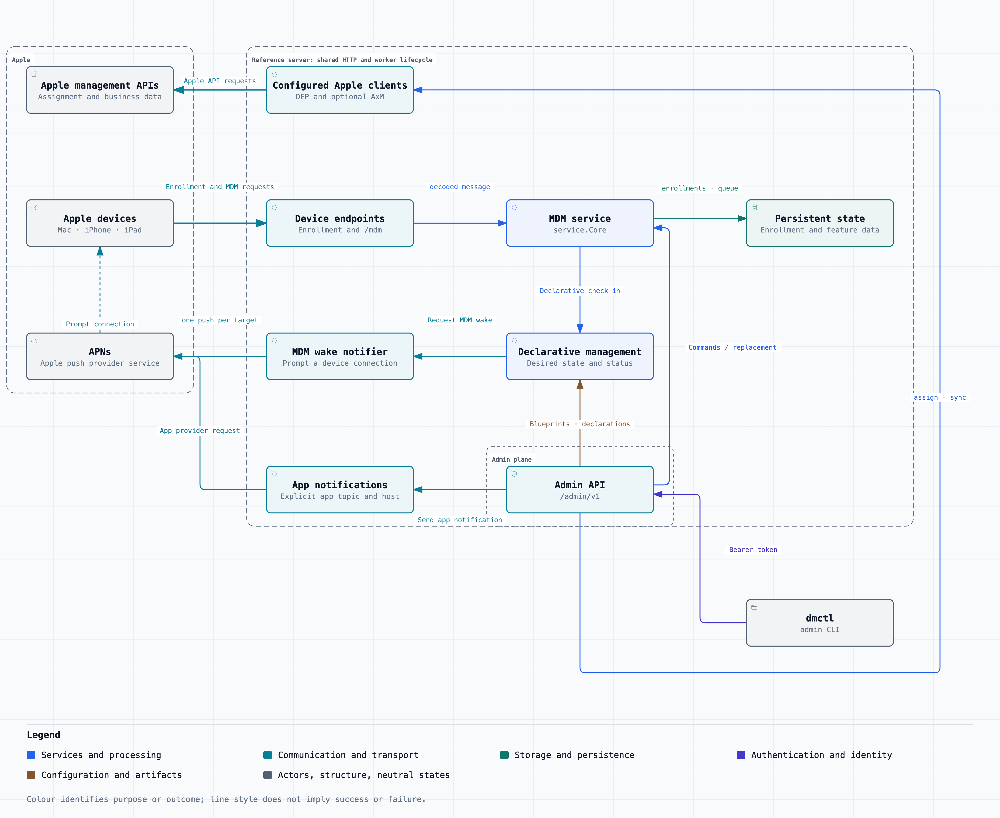

# go-apple-dm

[](https://github.com/deploymenttheory/go-apple-dm/releases)
[](https://github.com/deploymenttheory/go-apple-dm/actions/workflows/ci.yml)
[](https://pkg.go.dev/github.com/deploymenttheory/go-apple-dm)
[](https://go.dev/)
[](LICENSE)


A pure Go library for Apple device management: the MDM check-in and command protocol,
Declarative Device Management (DDM), every enrollment path Apple documents (profile, automated,
account-driven, user channel and Shared iPad), an ACME server with Managed Device Attestation,
and clients for the device enrollment service and the Apple Business Manager API. A thin
reference server, `cmd/dmserver`, wires it all together.

## Why

Apple documents its device management protocol thoroughly, and in Go it has never been available
as something you can simply import. The implementations that exist are servers first. NanoMDM is
deliberately minimal: it hides `context.Context` inside a request struct, hands DDM check-ins back
as raw `[]byte`, and offers a single webhook as its one integration point. KMFDDM runs declarative
management as a separate experimental process. Fleet's MDM is a product, and vendors NanoMDM and
NanoDEP as forks rather than depending on them. Each is a sound answer to the question it was
built to answer, and this library learns from all three. None of them is a library you can build
your own product on.

That is what this is. The protocol, the declarative engine, every enrollment path, and the Apple
service clients, as ordinary Go packages you import into your own program and wire the way your
program needs.

- **Typed from Apple's own schema, not by hand.** All 65 commands with their responses, check-in
  messages, profiles, declarations, status and protocol types are generated in this repository from
  the pinned `apple/device-management` YAML, along with the metadata that answers whether a key
  applies to a supervised Mac on 15.0. A naming lock makes regeneration fail loudly rather than
  rename a type out from under you, so Apple's schema drift becomes `make generate` and a diff to
  review instead of a manual audit every autumn.
- **A library shape, held to deliberately.** `context.Context` first, typed errors, and a hook
  chain; every state change is a typed event on an in-process bus, so audit trails, webhooks,
  metrics, and reconcilers are ordinary subscribers rather than special cases wired into the core.
- **Storage you choose.** Interfaces split by concern, with in-memory, SQLite, PostgreSQL, and
  MySQL backends that all pass one contract suite. Secrets at rest are sealed under named keys with
  in-place rotation.
- **The whole surface, not the core alone.** The parts most projects leave you to write — ACME
  with Managed Device Attestation, account-driven enrollment, Shared iPad, the device enrollment
  service, the Business Manager API — are here, each with a fake for your tests.
- **Testable without hardware.** A device simulator speaks MDM, DDM, ADE, account-driven, user
  channel, Shared iPad, and ACME, so your server can be exercised end to end before a real device
  ever touches it. The coverage floor is 95%, gated in CI.

What it is not: a product. There is no UI, no inventory, and no fleet management. `cmd/dmserver`
is a thin wiring of these packages, there to prove the library works and to be read as an example
of using it, not to be deployed as a device management platform. Nothing is copied from the
projects above; `github.com/micromdm/plist` is the single dependency shared with them, so fixtures
interoperate. The reasoning behind all of this is decision record
[0001](docs/research/decisions/0001-architecture.md), and the projects studied are credited in
[reference_projects.md](docs/research/reference_projects.md).

## Quick start

```bash
go get github.com/deploymenttheory/go-apple-dm
```

A check-in and command endpoint over an in-memory store, and a typed command queued for a device:

```go
package main

import (
	"context"
	"log"
	"net/http"

	"github.com/deploymenttheory/go-apple-dm/httpapi"
	"github.com/deploymenttheory/go-apple-dm/mdm"
	"github.com/deploymenttheory/go-apple-dm/schema/commands"
	"github.com/deploymenttheory/go-apple-dm/service"
	"github.com/deploymenttheory/go-apple-dm/storage"
	"github.com/deploymenttheory/go-apple-dm/storage/inmem"
)

func main() {
	core, err := service.New(service.Config{Store: inmem.New()})
	if err != nil {
		log.Fatal(err)
	}

	// One path serves check-in and connect; the handler routes on content type,
	// and the middleware takes the device identity from the TLS peer certificate.
	http.Handle("/mdm", httpapi.CertFromTLS(httpapi.Handler(httpapi.Config{
		Checkin: core,
		Connect: core,
	})))

	// The payload carries its own RequestType; the envelope gets a time-ordered
	// CommandUUID. Targets are checked against the schema before they are queued.
	cmd, err := mdm.NewCommand(&commands.DeviceInformation{})
	if err != nil {
		log.Fatal(err)
	}
	id := mdm.EnrollmentID{Channel: mdm.ChannelDevice, ID: "00008030-000000000000001E"}
	if _, err := core.Enqueue(context.Background(), []mdm.EnrollmentID{id}, cmd, storage.EnqueueOptions{}); err != nil {
		log.Fatal(err)
	}

	log.Fatal(http.ListenAndServe(":8080", nil))
}
```

Swap `inmem.New()` for `sqlite.Open`, `postgres.Open`, or `mysql.Open` and nothing above changes.
For a real deployment add a push certificate, an enrollment identity (SCEP or ACME), and TLS; the
reference server shows each of those wired together.

### Or run the reference server

```bash
# One terminal: an all-in-one process on :8080, nothing to install.
DM_ROLE=all DM_STORAGE=inmem DM_ADMIN_TOKEN=dev-token go run ./cmd/dmserver

# Another: ask it what it is.
curl -s localhost:8080/healthz
go run ./cmd/dmctl -server http://localhost:8080 -token dev-token status
```

```
Role:           all
Version:        v0.0.0-20260903102158-a26bcbb63052
Families:       ddm, dep, introspection, mdm
Authorization:  static token (development)
Break-glass:    active (the only credential; no principal store configured)
```

`DM_ADMIN_TOKEN` is a break-glass credential for getting started: it bypasses policy and cannot be
revoked without a restart. Create real principals with it, then unset it. Every variable is in
[Reference server](#reference-server) below, and `make docker-build` produces the container image.

### Explore the protocol without a server

`dmctl explain` reads the generated schema tables offline, so it needs neither a server nor a
device:

```bash
go run ./cmd/dmctl explain DeviceInformation
go run ./cmd/dmctl explain DeviceInformation -target macos:15.0,supervised
go run ./cmd/dmctl explain com.apple.configuration.softwareupdate.enforcement.specific
```

From there: [docs/diagrams](docs/diagrams/README.md) for how the pieces fit together,
[e2e/](e2e/) and [docs/testing/e2e-scenarios.md](docs/testing/e2e-scenarios.md) for worked
end-to-end scenarios, and [`simulator/`](simulator/) to drive a server without hardware.

## Architecture

<picture>
  <source media="(prefers-color-scheme: dark)" srcset="docs/diagrams/system-architecture.dark.png">
  
</picture>

Twenty-seven interactive diagrams cover each component and each protocol flow, from package
layering to the ACME attestation exchange. Architecture diagrams carry git-verified source pins.
See [docs/diagrams](docs/diagrams/README.md).

## What it provides

- **Protocol core.** Typed check-in, command, and response messages generated from Apple's
  `device-management` schema, never hand-edited. Detached and attached CMS verification.
- **Service layer.** Enrollment lifecycle, identity pinning, command queue with dedupe keys,
  hooks and an event bus, user-channel and Shared iPad handling, optional user authentication
  gate, and schema-driven checks that a command is supported by the enrolled OS and version.
- **Storage.** In-memory, SQLite (pure Go), PostgreSQL, and MySQL behind one contract-tested
  interface set. Secret columns are sealed with AES-256-GCM under named keys with in-place
  rotation. Every schema lives in a single `0001_init.sql` per dialect per migration set.
- **Push.** APNs HTTP/2 client, notifier with invalid-token events, coalescing, push certificate
  parsing and topic derivation, and a fake APNs server for tests.
- **Enrollment identities.** A certificate authority abstraction and a SCEP service with
  one-time and HMAC challenges, plus a client. Or ACME with Managed Device Attestation: the
  device generates a key in its Secure Enclave, Apple attests to the key and the hardware, and
  the server issues only after checking that attestation against the device it expected and
  against a policy of your choosing.
- **Enrollment paths.** Profile enrollment with an OTA profile service; automated device
  enrollment with typed `MachineInfo` parsing, CMS signature verification against Apple's
  device CAs, the software update gate, and an OIDC web view; service discovery for
  account-driven enrollment with both the `apple-as-web` and `apple-oauth2` flows on an
  authorization server of our own; user channel enrollment and Shared iPad users.
- **Device enrollment service (DEP).** OAuth 1.0a session client with cursor handling, token
  PKI for the portal exchange, a device syncer, a profile assigner with read-back, in-memory and
  SQL stores, and a fake service for tests.
- **Apple Business Manager API.** ES256 client assertion, JSON:API paging, device and server
  listing, assignment activities with convergence, rate-limit handling, and a fake server.
- **Declarative Device Management.** Declarations with content-addressed `ServerToken`s
  (RFC 8785 canonical JSON), sets and dynamic membership, per-enrollment snapshots so a device
  always fetches what its manifest advertised, status reports stored per item, synthesised
  status subscriptions, an NSPredicate subset validated at upload, and a coalescing change
  notifier. The engine runs in-process or split across our own `mdm` and `ddm` roles.
- **Managed Device Attestation.** Chain verification to the Apple Enterprise Attestation Root,
  a required freshness code, the attested key bound to the key being certified, and all ten of
  Apple's device property extensions parsed by their documented types. The same verifier reads
  an ACME challenge response and a `DevicePropertiesAttestation` query response.
- **Device simulator.** MDM, DDM, ADE, account-driven, user channel, Shared iPad, and ACME
  clients so a server can be tested without hardware.
- **Reference server.** Roles `mdm`, `ddm`, and `all`, a bearer-protected admin API, `DM_*`
  environment configuration, `/healthz`, and a distroless container image built by CI.

## Layout

| Path | Purpose |
|---|---|
| `schema/` | Generated types from `third_party/device-management` (never hand-edited); `schema/support` answers whether a command or key applies to an OS and version |
| `internal/schemagen`, `cmd/admgen` | The generator |
| `mdm/` | Protocol core: enrollment identity, check-in decoding, command and response envelopes |
| `cms/` | Detached and attached CMS signing and verification, `Mdm-Signature` with signing-time tolerance |
| `service/` | Enrollment lifecycle, identity pinning, command delivery, hooks, events, user channels, target validation |
| `paging/` | Cursor pagination shared by every store contract: `Page`, `Result[T]`, and the size bounds, so a contract can be paginated without depending on `storage` |
| `storage/` | Storage interfaces, in-memory backend, and the contract suite every backend runs |
| `storage/sqlcommon`, `storage/sqlite`, `storage/postgres`, `storage/mysql` | One SQL implementation with embedded migrations for SQLite (pure Go), PostgreSQL (pgx), and MySQL; secret columns sealed when a keyring is configured |
| `storage/crypt` | AES-256-GCM sealing of secret columns under named keys from `secrets.Provider`, with row-bound AAD and in-place key rotation |
| `httpapi/` | Check-in and server URL handlers plus certificate extraction middlewares |
| `push/`, `push/apns` | Pusher interface, notifier, coalescing, HTTP/2 APNs client and fake server, and a store-backed certificate cache |
| `pushcert/` | Push certificate parsing and topic derivation; standard library only, so `storage` can validate an uploaded certificate without depending on `push` |
| `ca/`, `scep/` | Certificate authority abstraction and a SCEP endpoint with one-time and HMAC challenges, plus a client |
| `profile/`, `enroll/` | Configuration profile composition, signing, and parsing; MDM enrollment profile builder (device, user, Shared iPad); OTA profile service |
| `enroll/ade`, `enroll/adetest` | Automated device enrollment: `MachineInfo` parsing and CMS verification, the software update gate, web view resume and finish, DEP lookup and policy hooks; fixtures and a fake device CA |
| `enroll/webauth`, `enroll/webauthtest` | OpenID Connect relying party for the ADE web view and account-driven pages; a fake identity provider |
| `enroll/discovery` | The `/.well-known/com.apple.remotemanagement` service discovery document, per user type |
| `acme/` | ACME server for Apple's ACME payload: directory, nonces, accounts, orders, the `device-attest-01` challenge, finalize, and certificate download; one-time client identifiers bound to a device; policy hooks that decide which devices may enroll |
| `acme/jose` | JWS and JWK for RFC 8555, including the interop fix for Apple clients that omit leading zero bytes from an ECDSA signature |
| `acme/attest`, `acme/attest/attesttest` | Managed Device Attestation verification, and a stand-in attestation authority for tests and the simulator |
| `acme/inmem`, `acme/sqlstore`, `acme/acmetest` | ACME state on its own migration set, with the contract suite every backend runs |
| `internal/cbor` | The strict CBOR subset an attestation object uses, fuzzed |
| `enroll/accountdriven` | Account-driven enrollment: the `Bearer` challenge, `apple-as-web` and `apple-oauth2` flows, token issuance, and the check-in hook that ties the enrollment to the authenticated account |
| `dep/`, `dep/inmem`, `dep/sqlstore`, `dep/deptest` | Device enrollment service client (OAuth 1.0a, sessions, cursors, token PKI), device syncer, profile assigner, stores, contract suite, and the fake service |
| `axm/`, `axm/axmtest` | Apple Business Manager API client (ES256 client assertion, JSON:API paging, activities) and its fake server |
| `gdmf/`, `gdmf/gdmftest` | Apple's software update catalogue client for the ADE software update gate, with a fake |
| `secrets/` | Redacting secret type and providers (static, environment, directory, chain) |
| `ddm/` | Declarative Device Management engine: content-addressed declarations, sets and membership, snapshots, status reports, status subscriptions, cleanup on CheckOut, change notifier |
| `audit`, `audit/inmem`, `audit/sqlstore`, `audit/audittest` | The persistent audit trail on its own migration set, append-and-prune, with the contract suite all four backends pass |
| `event`, `eventsink` | The typed event bus, and the sinks that project an event down to what may leave the process before an slog record or a webhook carries it |
| `ddm/predicate`, `internal/canonjson` | The NSPredicate subset activations use; RFC 8785 canonicalisation over `encoding/json/jsontext` |
| `ddm/inmem`, `ddm/sqlstore`, `ddm/ddmtest` | Engine stores on their own migration set and the contract suite both run |
| `ddm/adapter/inproc`, `ddm/adapter/proxyclient`, `ddm/adapter/proxyserver` | DDM in-process, or split across our own `mdm` and `ddm` roles over an HMAC-signed or mTLS hop |
| `internal/app`, `cmd/dmserver`, `Dockerfile` | The reference server: roles, enrollment routes, admin API, background workers, and the container image |
| `simulator/` | Device simulator: MDM, DDM, ADE, account-driven, user channel, and Shared iPad clients |
| `e2e/` | End-to-end scenarios (`make test-e2e`), listed in `docs/testing/e2e-scenarios.md` |
| `docs/research/` | Reference research, the plan of record, and per-feature decision records |
| `docs/security/threat-model.md` | STRIDE threat model, updated every phase |

## Reference server

`cmd/dmserver` runs one of three roles. `mdm` serves devices (`/mdm`, `/scep`, the
enrollment routes) and forwards DDM check-ins to a `ddm` role when `DM_DDM_URL` is set; `ddm`
runs the engine and the admin API; `all` runs everything in one process. Configuration is by
environment:

| Variables | Purpose |
|---|---|
| `DM_ROLE`, `DM_LISTEN`, `DM_STORAGE`, `DM_DSN` | Role, listen address, backend (`sqlite`, `postgres`, `mysql`, `inmem`), and DSN |
| `DM_ADMIN_STORE` | Open the admin principal and Cedar policy store on this process's database, so `dmctl principals` and `dmctl policies` work. Off by default: it mounts the admin API |
| `DM_ADMIN_TOKEN` | Break-glass bearer token for `/admin/v1/`. Authenticates as root and **bypasses policy**, has no expiry, and cannot be revoked without a restart. It exists because an empty principal store authenticates nobody: set it to create the first principals, then unset it and restart. Its use is audited under the actor `break-glass`, and `dmctl status` reports whether it is still accepted |
| `DM_STORAGE_KEYS`, `DM_STORAGE_KEY_<NAME>`, `DM_SECRETS_DIR`, `DM_STORAGE_KEYS_STRICT` | Keys sealing the secret columns of a persistent store: unlock and bootstrap tokens, APNs push keys, user auth tokens. `DM_STORAGE_KEYS` lists key names active-first, and the material comes from `DM_STORAGE_KEY_<NAME>` or from files in `DM_SECRETS_DIR`. A rotation prepends a name and runs `Rewrap`; `DM_STORAGE_KEYS_STRICT` then refuses any row still in clear. A persistent backend will not start without this |
| `DM_ALLOW_REENROLL` | Accept an `Authenticate` whose certificate differs from the enrollment's pin, replacing it. Off by default: a certificate carries no binding to an enrollment id, so allowing this makes every certificate the CA issues a key to every enrollment. Turn it on only where devices re-enrol themselves after a wipe |
| `DM_DDM_URL`, `DM_DDM_SEND_KEY`, `DM_DDM_RECV_KEY`, `DM_DDM_SUBSCRIPTIONS` | The split-deployment hop and synthesised status subscriptions. Both keys are required on either side: the hop carries a check-in verbatim and the receiving role trusts the enrollment id in that body |
| `DM_CA_FILE`, `DM_CERT_HEADER` | Client certificate verification, direct or behind a proxy |
| `DM_PUBLIC_URL`, `DM_PUSH_TOPIC` | Turn on the enrollment routes; the server URL devices are given and the push topic |
| `DM_ENROLL_CA_CERT_FILE`, `DM_ENROLL_CA_KEY_FILE`, `DM_SCEP_CHALLENGE`, `DM_SCEP_HMAC_KEY` | The enrollment identity CA and its SCEP challenge; a self-signed CA is generated for development |
| `DM_IDENTITY` | Where an enrolled device's identity comes from: `scep` (the default) or `acme` |
| `DM_ACME_POLICY`, `DM_ACME_KEY`, `DM_ACME_HMAC_KEY`, `DM_ACME_ANCHOR_FILE`, `DM_ACME_ALLOW_UNATTESTED`, `DM_ACME_IDENTIFIER_TTL` | Which devices may enroll (`any`, `dep`, `sip`), the key the device generates (`ec256`, `ec384`, `rsa2048`, `rsa4096`), the key that mints client identifiers, extra attestation anchors for a lab, whether a device that cannot attest may enroll, and how long a client identifier stays usable |
| `DM_PROFILE_IDENTIFIER`, `DM_ORGANIZATION` | Enrollment profile identity |
| `DM_DISCOVERY`, `DM_ACCOUNT_DRIVEN_METHOD` | Service discovery per user type (`Mac=mdm-adde,iPhone=mdm-byod`) and the account-driven flow (`apple-as-web` or `apple-oauth2`) |
| `DM_OIDC_ISSUER`, `DM_OIDC_CLIENT_ID`, `DM_OIDC_CLIENT_SECRET` | The identity provider behind the ADE web view and account-driven pages |
| `DM_ADE_ANCHOR_FILE`, `DM_ADE_AUDIT`, `DM_REQUIRE_USER_AUTH` | Extra `MachineInfo` signing anchors, audit-only signature policy, and the user authentication gate |
| `DM_AXM_CLIENT_ID`, `DM_AXM_KEY_ID`, `DM_AXM_KEY_FILE`, `DM_AXM_SCOPE`, `DM_AXM_BASE_URL`, `DM_AXM_TOKEN_URL` | Apple Business Manager API credentials; enables `/admin/v1/axm/` |
| `DM_AUDIT_STORE`, `DM_AUDIT_RETENTION` | Persist every event to the persistent audit trail on this process's database, and how long to keep records (unset keeps them forever). Read it at `GET /admin/v1/audit` or with `dmctl audit list --since 1h` |
| `DM_AUDIT_LOG`, `DM_WEBHOOK_URL`, `DM_WEBHOOK_HMAC_KEY` | Event sinks: a projected slog record per state change, and a MicroMDM-compatible webhook with an optional SHA-256 body signature. Both off by default. The webhook envelope matches MicroMDM and NanoMDM except that it carries no `raw_payload`, because theirs is the raw check-in body and a `TokenUpdate` body contains the device unlock token |
| `DM_DEP_BASE_URL`, `DM_DEP_SYNC_INTERVAL`, `DM_DEP_ASSIGN_INTERVAL`, `DM_DEP_PROFILE_URL`, `DM_DEP_USE_PUT` | Device enrollment service endpoint, the background sync worker, and the DEP profile url (defaults to this server) |
| `DM_PUSH_SOURCE`, `DM_PUSH_CERT_FILE`, `DM_PUSH_KEY_FILE`, `DM_PUSH_HOST`, `DM_PUSH_COALESCE`, `DM_PUSH_CERT_TTL` | Where APNs credentials come from and how pushes are shaped: `off`, `file` (the PEM pair, which a certificate path alone implies) or `store` (the push certificate store). The topic is read from the certificate rather than typed, so it has no variable of its own; `DM_PUSH_HOST` overrides the APNs endpoint for a lab, `DM_PUSH_COALESCE` is the window repeated pushes collapse into (negative disables it), and `DM_PUSH_CERT_TTL` how long a store-backed certificate is cached before its version is rechecked |

`cmd/dmctl` drives every one of those routes. Typed verbs cover the surfaces this project models
-- `enrollments`, `commands`, `push`, `pushcerts`, `export`/`import`, `declarations`, `sets`,
`notify`, `principals`, `policies`, `audit`, plus `status`, `routes` and `actions` -- and
`dmctl api <METHOD> <path>` reaches the rest, including the Business Manager, DEP and ACME
families that proxy Apple-shaped APIs. `dmctl explain` answers offline from the compiled-in
schema. E2E-024 walks the server's own route table and fails if any route cannot be driven.

The admin API manages declarations, sets, and assignments (`/admin/v1/declarations`, `/sets`,
`/enrollments`), Business Manager servers, devices, and activities (`/admin/v1/axm/`), DEP
accounts: token PKI generation, `.p7m` import, device listing, profile definition, and sync
(`/admin/v1/dep/accounts/`), and issued ACME identities with the hardware Apple attested for
each (`/admin/v1/acme/certificates`). The exact routes and constants are in `internal/app`.

## Development

```bash
git submodule update --init   # pinned Apple schema
make ci                       # lint, verify, test, storage, e2e, fuzz smoke, coverage gate
make testdb-up                # PostgreSQL and MySQL in Docker for `make test-storage` and `E2E_STORE=postgres make test-e2e`
make test-storage-perf        # the 100k-row Clear timing gate on PostgreSQL, without the race detector
make testdb-down              # remove the Docker test databases
make testdb-ddm-up            # build our image and run the ddm role for `TestE2E_DDMSplitDeployment`
make testdb-ddm-down          # remove the ddm role container
make refs                     # clone the reference projects for research (never imported)
```

Coverage floor is 95% overall and per package. See `Makefile` targets with `make help`.

Dependencies stay minimal on purpose: the plist codec, the smallstep CMS and SCEP libraries,
the SQL drivers, `golang.org/x/crypto`, and `cedar-policy/cedar-go` for admin authorization.
OAuth 1.0a, the ES256 client assertion, the OIDC relying party, the OAuth 2 authorization server,
the ACME server, its JWS layer, and the CBOR subset an attestation object needs are all
implemented in this module. Cedar is the one deliberate exception, and decision record 0034 gives
the reasoning: an authorization policy language is not a few hundred lines of parsing the way a
JWS serialisation or a CBOR subset is, and hand-rolling one is how the reference CAs ended up
matching URL prefixes. The simulator drives the ACME server with `golang.org/x/crypto/acme`,
because testing a server against its own client shows only that the two agree. Nothing from
NanoMDM or MicroMDM is imported beyond the plist package.

## Sources

Apple's [Device Management documentation](https://developer.apple.com/documentation/devicemanagement)
and the [apple/device-management](https://github.com/apple/device-management) schema repository are
the primary sources. The open source projects this work learns from are catalogued in
[docs/research/reference_projects.md](docs/research/reference_projects.md).

## Contributing

See [CONTRIBUTING.md](CONTRIBUTING.md) and the decision record process in
[docs/research/decisions/README.md](docs/research/decisions/README.md).

## License

MIT. See [LICENSE](LICENSE).
