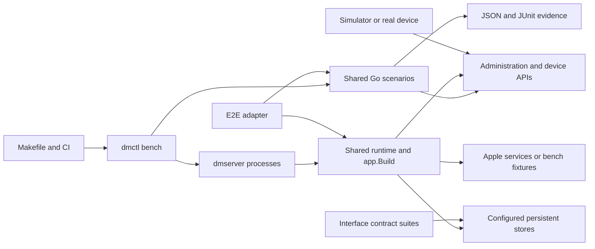

# Architecture

The repository contains a reusable protocol library and a reference server. This guide describes
the implemented design. [Design decisions](research/decisions/README.md) provide the supporting
contracts and rationale; [diagrams](diagrams/README.md) show component and protocol views.

## Modules and dependency direction

| Module | Contents | Dependencies |
|---|---|---|
| `github.com/deploymenttheory/go-apple-dm` | Protocol codecs, generated schema, enrollment, PKI, Apple clients, storage contracts, in-memory stores and simulator | Plist and CMS/SCEP libraries, cryptography, OpenTelemetry and YAML tooling; exact versions in the root `go.mod` |
| `github.com/deploymenttheory/go-apple-dm/server` | SQL stores, service orchestration, HTTP adapters, admin authorization, event sinks, reference server and CLI | Root module, SQLite/PostgreSQL/MySQL drivers and Cedar; exact versions in `server/go.mod` |

Both modules use Go 1.27. `go.work` joins them for local development. Library code and tests
live under `devicemanagement/`, which introduces a package-path prefix without creating a module. They
cannot import the server module. `internal/layout` checks the import graph and tier ordering,
including the explicit dependency from the ADE software update gate to the GDMF client.

| Area | Paths | Responsibility |
|---|---|---|
| Foundation | `devicemanagement/paging`, `devicemanagement/clock`, `devicemanagement/secrets`, `devicemanagement/telemetry`, `devicemanagement/state`, `devicemanagement/ratelimit`, `devicemanagement/testpki` | Shared interfaces, bounded state and test utilities |
| Schema | `devicemanagement/schema`, `internal/schemagen`, `cmd/schemagen` | Deterministic generation and schema-derived validation/support metadata |
| Protocol | `devicemanagement/mdmprotocol` | Plist/CMS, MDM messages, enrollment profiles and handlers, DDM engine, predicates, hooks and events |
| PKI | `devicemanagement/pki` | CA abstraction, SCEP, ACME, attestation, push certificate parsing and optional revocation |
| Apple clients | `devicemanagement/appleplatformservices` | APNs, device enrollment service, software lookup, Business Manager and School Manager APIs |
| Content-cache metrics | `devicemanagement/contentcache` | Opt-in seed report contract and receiver; consumers supply authentication, TLS and persistence |
| Persistence | `devicemanagement/storage`, `server/sqlstore`, `server/*store`, `server/statestore` | Domain contracts, memory implementations and SQL persistence |
| Service | `server/service`, `server/httpapi`, `server/ddmsync`, `server/ddmadapter`, `server/pushnotify` | Enrollment authorization, command delivery, DDM synchronization and transport |
| Administration | `server/adminauth`, `server/audit`, `server/eventsink`, `server/axmcreds` | Principals, policy, credential storage, projected audit and webhook output |
| Composition and testing | `server/internal/app`, `server/internal/dmctl`, `server/cmd`, `server/e2e`, `devicemanagement/simulator` | Application wiring, CLI and executable scenarios |

The table groups responsibilities; the exact enforced tiers and test-only exceptions are in
[internal/layout/layout_test.go](../internal/layout/layout_test.go).

The [content-cache receiver](research/decisions/0051-content-cache-metrics.md) is
an embeddable library at the service-client tier. It installs no reference-server
route. Its reviewed OS 27 OpenAPI fixture is independent of the stable schema pin.

## Generated protocol types

The pinned `third_party/device-management` submodule supplies Apple's YAML definitions.
`schemagen` generates request and response types, registries, validation, platform support metadata
and conformance fixtures. `devicemanagement/schema/GENERATED_FROM.json` records source provenance;
`devicemanagement/schema/EXPORTED_IDENTIFIERS.lock` guards exported names. `make verify` regenerates into a
temporary directory and checks the output and removal guard. Generated validation covers the
modeled schema constraints; protocol rules documented only in prose belong in the calling code.

The [Apple schema monitor](schema-monitor.md) discovers Apple's stable default
and `seed*` branches, assesses immutable commits in isolated workspaces, then
publishes grouped engineering issues and generated update PRs. Stable updates
target the project default branch; seed updates stay in separate draft previews.
Parsing failures retain raw schema findings and block dependent generation and
runtime checks. Server tests explicitly resolve the candidate library through
the workspace, without changing the server's published dependency requirement.

## Enrollment and command service

`server/httpapi` extracts a certificate through CMS, mutual TLS or an explicitly trusted proxy.
The deployment must establish certificate trust and proof of possession for its transport.

Command enqueueing validates the actual wire envelope and known payloads before
storage. Required fields and value constraints always apply. With target validation
enabled, both command and populated-field availability are checked per enrollment;
unsupported targets appear in the enqueue result's skipped entries. Unknown command
types retain their wire bytes for caller-supplied extensions. Callers that previously
queued incomplete known commands must now provide valid required input.

Fleet eligibility requires known OS and version inventory; inventory commands
remain available to establish it. A tracked inventory acknowledgment refreshes
the device's product, OS and build version. Dispatch rechecks queued work after
that refresh and individually clears ineligible commands through the optional
`storage.CommandClearer` extension, retaining audit rows and valid queued work.
Seed generation retains a pinned historical schema so adopting new definitions
does not remove management support for older devices. See
[decision 0052](research/decisions/0052-mixed-os-fleets.md).
`server/service` applies certificate status checks when configured, hooks, pinning and enrollment
policy before dispatch. Its default certificate reuse policy denies association with a second
enrollment. Both the reusable service and reference server deny changed identities during
re-enrollment by default; authorized profile replacement follows its own policy and state.

Profile-based enrollment supports SCEP, ACME or supplied PKCS#12 identities and OTA profile
delivery. Automated Device Enrollment parses signed `MachineInfo`, supports an OS update gate
and OIDC web authentication, and exposes admission hooks. Organizational ownership checks are
caller policy; the reference server does not require a live device enrollment service lookup.

Account-driven Device Enrollment and account-driven User Enrollment use service discovery,
`apple-as-web` or `apple-oauth2`, and reusable access tokens. A trusted issuance callback associates
the authenticated account with the certificate. The first `Authenticate` reserves the enrollment
identifier; successful storage confirms it. These are separate store operations with retry
semantics, not a distributed transaction. Subsequent requests follow the platform/channel bearer
rules. See [enrollment security operations](operations/enrollment-security.md) for migration.

Commands are checked against available target metadata, queued with deduplication options and
delivered through the MDM connect exchange. Responses persist results and drive retry behavior.
Support checks use recorded supervision/ADE/user-approval observations; unknown capabilities
cannot satisfy a command requirement. They cannot replace deployment eligibility policy. The optional user
authentication gate checks for a stored user token on eligible `TokenUpdate` requests; it does not
validate a token supplied with that request.

## Declarative device management

DDM extends an existing MDM enrollment. The engine stores declarations, sets and membership,
builds per-enrollment snapshots and serves the versions advertised by those snapshots. Canonical
JSON determines content tokens. Status reports update stored items; subscriptions can be
synthesized. Predicates use the documented subset in
[mdmprotocol/ddm/predicate](../devicemanagement/mdmprotocol/ddm/predicate/doc.go), not the full NSPredicate language.

`server/ddmsync` converts pending changes into `DeclarativeManagement` commands and pushes.
The engine can run in process or behind the project's private `POST /v1/declarative-management`
proxy. The reference composition requires HMAC keys in both directions. Request signatures
cover the body; response signatures cover status and body. TLS supplies confidentiality. The
adapter library also exposes mutual TLS and bearer options; these are not reference-server
environment settings. The proxy has no replay nonce store.

## Certificates and admission controls

SCEP challenges and ACME client identifiers control issuance. ACME validates account JWS,
nonces, orders and optional `device-attest-01` evidence. The attestation verifier checks the
configured trust chain, freshness, device properties and requested key binding. Unattested
issuance requires explicit policy. Simulator certificates do not establish Apple hardware
compatibility. Hardware-aware profile and credential composition follows current Apple
Developer documentation; differences from pinned YAML are recorded in
[decision 0033](research/decisions/0033-acme-identity-in-profiles-and-ddm.md).
Attestation requirements bind each issuance identifier and cannot be overridden
by a global unattested policy. Library `scep.Grants` and `CertificateIssuer`
reserve verified CSRs and persist exact certificates before required registration.
Shared stores serialize retries across replicas; callbacks recheck admission.

Reference certificate revocation is enabled by default; inbound rate limiting is separately configured. Enabled revocation
registers issuance before returning certificates and enforces status independently of pin mode;
CRL and OCSP publication require persistent issuer keys. Quotas use atomic per-peer and aggregate
buckets with bounded state. SQL accounting uses database time after locking. Both controls depend
on shared protocol state when multiple processes serve the same deployment.

## Persistence and operations

Memory storage is for development and loses state on restart. SQL implementations share domain
contract suites and use separate migration sets. Selected secret columns use AES-256-GCM with
row-bound additional authenticated data and named keys. Sealing includes raw check-in records,
commands/results, protocol state and credential-bearing declaration data. Metadata and
status/audit records are not whole-database encrypted. Protect the database, backups, profiles
and privileged plaintext exports accordingly.

The `all`, `mdm` and `ddm` roles compose services from environment configuration. Admin routes
use either an unrestricted bootstrap token or stored principals with Cedar policies. Event sinks
project permitted fields; raw event payloads remain inside the process. Audit persistence and
retention require configuration and do not provide tamper resistance against database operators.

Replicas must share the relevant database, issuer keys and configuration. Completed account
credentials, certificate associations and OIDC browser handoffs persist in shared SQL protocol
state in the reference composition. Trust roots,
public HTTPS, Apple credentials, network admission, backup protection and physical-device
validation remain deployment responsibilities. The [threat model](security/threat-model.md) and
[configuration guide](../README.md#reference-server) describe these boundaries.

## Shared reference-server runtime and scenarios

The [bench decision](research/decisions/0048-reference-server-bench.md) consolidates
local demonstration and automated execution around the ordinary server runtime.

The supervisor owns fake APNs, DEP, ABM, OIDC and attestation material. Those
fixtures are outside the application route table. Native TLS, worker readiness,
profile issuance, command results, OTA, user authentication and server-managed app
pushes are reusable server capabilities. Contract suites and detailed component
regressions keep their direct observation points; the shared scenarios use APIs.

See [bench/server operations](operations/reference-bench.md) for configuration,
API authorization and persistence, and [the catalogue](testing/bench-catalogue.md)
for execution modes and retained regression mappings.
