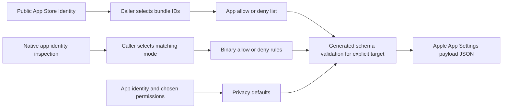

# App identity and App Settings utilities

`dmctl utility` discovers application identities and constructs validated App
Settings payloads. It requires no management-server configuration or credentials.
Public App Store Identity uses Apple's public HTTPS API. Native inspection uses
macOS tools. Payload construction works on every supported CLI platform.



## Public App Store Identity

Search a country storefront using an explicit software entity:

```sh
dmctl utility public-app-store-identity search 'Example' \
  -country GB -entity macSoftware -limit 50 -output json
dmctl utility public-app-store-identity lookup 123 \
  -country GB -entity software -output csv
```

Replace the example ID with a listing ID returned by search. Entities are
`software`, `iPadSoftware`, and `macSoftware`. Search returns at most the chosen
limit (default 50, maximum 200). `-all` is rejected because this API has no remote
pagination contract. IDs are exact numeric lookups; search text is not used as a
fallback.

Human output presents a table. JSON contains an array of listings, NDJSON emits
one listing per line, and CSV includes a header. Results include the requested
storefront and entity. Store listings do not establish installed code identity.

## Inspect installed code

```sh
dmctl utility appidentity inspect '/Applications/Example.app' \
  -output json > identity.json
dmctl utility appidentity inspect '/Applications/Example.app' -output csv
```

Inspection requires `/usr/bin/codesign` and `/usr/bin/lipo`; install Apple Command
Line Tools if lipo is unavailable. Every architecture of the main executable is
reported, including distinct CDHashes, signing identifiers, team identifiers,
designated requirements, and signature status/category. Bundle metadata comes
from Info.plist. Embedded helpers require separate inspection.

JSON and NDJSON emit one complete identity report. CSV emits one row per
architecture. Unsigned and invalid signatures remain visible in the report;
inspection can succeed while reporting them. Tool failures return exit 1. Binary
builders reject unsigned or invalid identity records. A report imported from a
file must come from a trusted source.

## Build app and binary controls

The target names the actual OS version, channel and enrollment capabilities.
These examples use schema-supported OS 27 targets; the version is an input, not
a utility release baseline.

```sh
dmctl utility appsettings allow \
  -bundle-id com.example.app -bundle-id com.apple.webapp \
  -target ios:27,channel=device,supervised > allowed-apps.json

dmctl utility appsettings deny -identity identity.json -match cdhash \
  -target macos:27,channel=device,supervised > denied-binaries.json

dmctl utility appsettings allow -identity identity.json -match app \
  -path-prefix '/Applications/Example.app/' -always-allow-managed-apps \
  -target macos:27,channel=device,supervised > allowed-binaries.json
```

`-identity -` reads a complete inspection report from stdin. Match modes are
`cdhash` (exact code), `app` (team plus signing ID), `team` (publisher), and
`signing-id` (denial only). Every architecture must contain the required facts.
The builder emits distinct rules as needed, without choosing a broader fallback.
`-path-prefix` is literal; a trailing slash restricts matching to directory
contents. `-signing-state` supplies an additional Apple schema constraint.

Use either repeated `-bundle-id` flags or `-identity`. Binary options cannot be
combined with app lists. `-always-allow-managed-apps=false` preserves explicit
false; omitting the flag leaves the field absent. Empty allow lists are rejected
because the generated serializer omits empty arrays.

## Build privacy defaults

Provide a JSON array of entries. Permission names and values use Apple's
generated `AppSettingsAppDictionary`, including `OrganizationJustification`:

```json
[
  {
    "bundleID": "com.example.app",
    "designatedRequirement": "identifier \"com.example.app\" and anchor apple generic",
    "permissions": {
      "OrganizationJustification": "Video meetings with colleagues",
      "Camera": "Allow"
    }
  }
]
```

Use the designated requirement obtained from the application's inspection
report; the example above illustrates the input format.

```sh
dmctl utility appsettings privacy -input privacy.json \
  -target macos:27,channel=user,supervised > privacy-payload.json
```

macOS keys combine the bundle ID and designated requirement. iOS uses the bundle
ID alone and rejects a supplied designated requirement. The builder rejects
duplicate keys, missing justifications, invalid permissions and unsupported
targets. macOS privacy defaults use the user channel; binary controls use the
device channel and therefore require separate payloads.

## Output and errors

App Settings commands always write the validated payload as JSON, including in
the default output mode. They do not publish or assign declarations. Use existing
DDM declaration or blueprint APIs to wrap the payload.

All utility JSON file/stdin input is limited to 8 MiB. Unknown fields, duplicate
JSON members, trailing documents and malformed values are rejected. Input and
policy validation errors return exit 2; I/O, native tool and HTTP failures return
exit 1. Successful discovery and construction return exit 0. `-timeout` bounds
outbound requests and native inspection; native inspection also has its own
30-second maximum.

See the [utility package guide](../../devicemanagement/utility/README.md) for
public library APIs, dependency boundaries, and Apple references.
